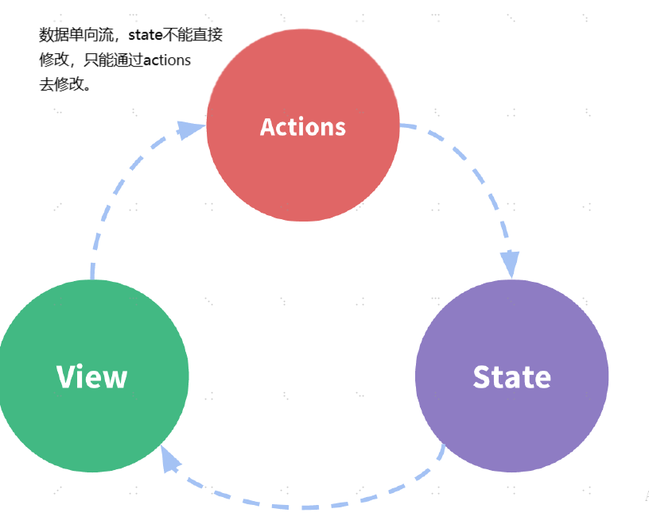

# 1. Vuex 状态管理

课程目标

- 组件通信方式回顾
- Vuex 核心概念和基本使用回顾
- 购物车案例
- 模拟实现 Vuex

## 1.1 组件内的状态管理流程

Vue 最核心的两个功能： 数据驱动和组件化。

组件化给我们带来了：

- 更快的开发效率
- 更好的可维护性

每个组件都有自己的状态、试图和行为等组成部分。

```js
new Vue({
  // state
  data() {
    return {
      count: 0,
    };
  },
  // view
  template: `      
    <div>{{ count }}</div>
    `,
  // actions
  methods: {
    increment() {
      this.count++;
    },
  },
});
```

状态管理包含以下几部分：

- state，驱动应用的数据源；
- view，以声明方式将 state 映射到视图；
- actions，响应在 view 上的用户输入导致的状态变化。



组件间通信方式回顾

大多数场景下的组件都并不是独立存在的，而是相互协作共同构成了一个复杂的业务功能。在 Vue 中为 不同的组件关系提供了不同的通信规则。


### 1.1.1 父传子：Props Down

[父级通过 props 给子级传递 数据](https://cn.vuejs.org/v2/guide/components.html#%E9%80%9A%E8%BF%87-Prop-%E5%90%91%E5%AD%90%E7%BB%84%E4%BB%B6%E4%BC%A0%E9%80%92%E6%95%B0%E6%8D%AE)

```html
<div id="app">
  <div>{{msg}}</div>
  <!-- 父级向子级传递值 -->
  <child title="hello child" :msg="msg"></child>
</div>

<script src="https://cdn.jsdelivr.net/npm/vue"></script>

<script>
  // 创建 vue 组件，并接受父级传递的数据
  Vue.component("child", {
    props: ["title", "msg"],
    template: `
            <div>
                <h3>静态传值-{{ title }}</h3>
                <h3>动态传值-{{msg}}</h3>    
            </div>
        `,
  });
  const vm = new Vue({
    el: "#app",
    data: {
      msg: "hello vue",
    },
  });
</script>
```

### 1.1.2 子传父：Event Up

[在子组件中使用 \$emit 发布一个自定义事件](https://cn.vuejs.org/v2/guide/components.html#%E7%9B%91%E5%90%AC%E5%AD%90%E7%BB%84%E4%BB%B6%E4%BA%8B%E4%BB%B6)

```html

```

在使用这个组件的时候，使用 v-on 监听这个自定义事件

[使用事件抛出一个值](https://cn.vuejs.org/v2/guide/components.html#%E4%BD%BF%E7%94%A8%E4%BA%8B%E4%BB%B6%E6%8A%9B%E5%87%BA%E4%B8%80%E4%B8%AA%E5%80%BC)

```js

```

### 1.1.3 非父子组件：Event Bus

[Event Bus](https://cn.vuejs.org/v2/guide/migration.html#dispatch-%E5%92%8C-broadcast-%E6%9B%BF%E6%8D%A2)

我们可以使用一个非常简单的 Event Bus 来解决这个问题：

eventbus.js :

```js
export default new Vue();
```

然后在需要通信的两端：

使用 \$on 订阅：

```js
// 没有参数
bus.$on("自定义事件名称", () => {
  // 执行操作
});
// 有参数
bus.$on("自定义事件名称", (data) => {
  // 执行操作
});
```

使用\$emit 发布：

```js
// 没有自定义传参
bus.$emit("自定义事件名称");
// 有自定义传参
bus.$emit("自定义事件名称", 数据);
```

### 1.1.4 父直接访问子组件：通过 ref 获取子组件

[ref](https://cn.vuejs.org/v2/guide/components-edge-cases.html#%E8%AE%BF%E9%97%AE%E5%AD%90%E7%BB%84%E4%BB%B6%E5%AE%9E%E4%BE%8B%E6%88%96%E5%AD%90%E5%85%83%E7%B4%A0)

ref 有两个作用：

- 如果你把它作用到普通 HTML 标签上，则获取到的是 DOM
- 如果你把它作用到组件标签上，则获取到的是组件实例

创建 base-input 组件

`` html
<template>
<input ref="input">
</template>

<script>
export default {
  methods: {
    // 用来从父级组件聚焦输入框
    focus: function () {
        this.$refs.input.focus()
    }
  }
}
</script>

````
在使用子组件的时候，添加 ref 属性：

``` js
<base-input ref="usernameInput"></base-input>
````

然后在父组件等渲染完毕后使用 \$refs 访问：

```js
mounted () {
  this.$refs.usernameInput.focus()
}
```

> $refs 只会在组件渲染完成之后生效，并且它们不是响应式的。这仅作为一个用于直接操作子组
件的“逃生舱”——你应该避免在模板或计算属性中访问 $refs 。

## 1.2 简易的状态管理方案

[简易的状态管理方案](https://cn.vuejs.org/v2/guide/state-management.html)

如果多个组件之间要共享状态(数据)，使用上面的方式虽然可以实现，但是比较麻烦，而且多个组件之间互相传值很难跟踪数据的变化，如果出现问题很难定位问题。

当遇到多个组件需要共享状态的时候，典型的场景：购物车。我们如果使用上述的方案都不合适，我们会遇到以下的问题

- 多个视图依赖于同一状态。
- 来自不同视图的行为需要变更同一状态。

对于问题一，传参的方法对于多层嵌套的组件将会非常繁琐，并且对于兄弟组件间的状态传递无能为力。

对于问题二，我们经常会采用父子组件直接引用或者通过事件来变更和同步状态的多份拷贝。以上的这些模式非常脆弱，通常会导致无法维护的代码。

因此，我们为什么不把组件的共享状态抽取出来，以一个全局单例模式管理呢？在这种模式下，我们的组件树构成了一个巨大的“视图”，不管在树的哪个位置，任何组件都能获取状态或者触发行为！

我们可以把多个组件的状态，或者整个程序的状态放到一个集中的位置存储，并且可以检测到数据的更改。你可能已经想到了 Vuex。

这里我们先以一种简单的方式来实现

- 首先创建一个共享的仓库 store 对象

```js
export default {
  debug: true,
  state: {
    user: {
      name: "xiaomao",
      age: 18,
      sex: "男",
    },
  },
  setUserNameAction(name) {
    if (this.debug) {
      console.log("setUserNameAction triggered：", name);
    }
    this.state.user.name = name;
  },
};
```

- 把共享的仓库 store 对象，存储到需要共享状态的组件的 data 中

```js
import store from "./store";
export default {
  methods: {
    // 点击按钮的时候通过 action 修改状态
    change() {
      store.setUserNameAction("componentB");
    },
  },
  data() {
    return {
      privateState: {},
      sharedState: store.state,
    };
  },
};
```

接着我们继续延伸约定，组件不允许直接变更属于 store 对象的 state，而应执行 action 来分发(dispatch) 事件通知 store 去改变，这样最终的样子跟 Vuex 的结构就类似了。这样约定的好处是，我们能够记录所有 store 中发生的 state 变更，同时实现能做到记录变更、保存状态快照、历史回滚/时光旅行的先进的调试工具。

## 1.3 Vuex 回顾

### 1.3.1 什么是 Vuex

[什么是 Vuex](https://vuex.vuejs.org/zh/)

> Vuex 是一个专为 Vue.js 应用程序开发的状态管理模式。它采用集中式存储管理应用的所有组件的状态，并以相应的规则保证状态以一种可预测的方式发生变化。Vuex 也集成到 Vue 的官方调试工具 [devtools extension](https://github.com/vuejs/vue-devtools)，提供了诸如零配置的 time-travel 调试、状态快照导入导出等高级调试功能。

- Vuex 是专门为 Vue.js 设计的状态管理库
- 它采用集中式的方式存储需要共享的数据
- 从使用角度，它就是一个 JavaScript 库
- 它的作用是进行状态管理，解决复杂组件通信，数据共享

### 1.3.2 什么情况下使用 Vuex

> 官方文档：
>
> Vuex 可以帮助我们管理共享状态，并附带了更多的概念和框架。这需要对短期和长期效益进行权衡。
>
> 如果您不打算开发大型单页应用，使用 Vuex 可能是繁琐冗余的。确实是如此——如果您的应用
> 够简单，您最好不要使用 Vuex。一个简单的 store 模式就足够您所需了。但是，如果您需要构建一个中大型单页应用，您很可能会考虑如何更好地在组件外部管理状态，Vuex 将会成为自然而然的选择。引用 Redux 的作者 Dan Abramov 的话说就是：Flux 架构就像眼镜：您自会知道什么时候需要它。

当你的应用中具有以下需求场景的时候：

- 多个视图依赖于同一状态
- 来自不同视图的行为需要变更同一状态

建议符合这种场景的业务使用 Vuex 来进行数据管理，例如非常典型的场景：购物车。

注意：Vuex 不要滥用，不符合以上需求的业务不要使用，反而会让你的应用变得更麻烦。

### 1.3.3 核心概念回顾
